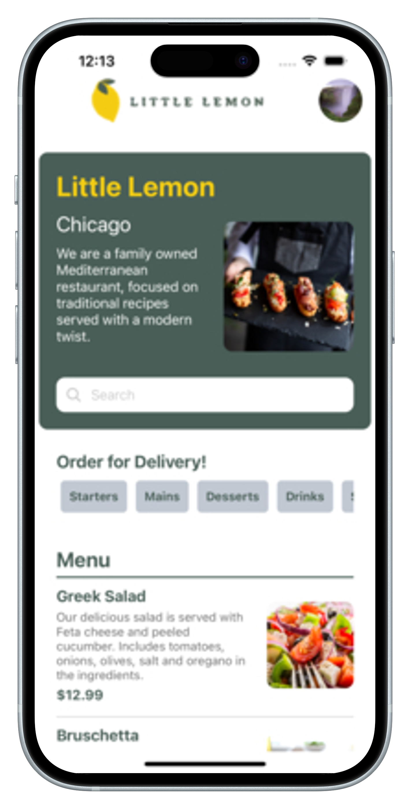

# 🍋 Little Lemon Restaurant App

<div align="center">
  
</div>

<div align="center">

[](https://reactnative.dev/)
[](https://expo.dev/)
[](https://firebase.google.com/)
[](https://www.javascript.com/)


</div>

> A modern, feature-rich React Native mobile application for a Mediterranean restaurant showcasing contemporary mobile development practices with Firebase integration, state management, and clean architecture.

## 🌟 Features

### 🔐 Authentication & User Management
- **Secure Authentication** - Email/password authentication with Firebase Auth
- **User Profiles** - Complete profile management with avatar upload
- **Persistent Sessions** - Automatic login persistence with AsyncStorage
- **Password Recovery** - Built-in password reset functionality

### 🍽️ Menu & Discovery
- **Dynamic Menu** - Real-time menu browsing with Firebase Firestore
- **Smart Search** - Instant search by dish name or description
- **Category Filtering** - Filter menu items by food categories
- **Rich Media** - High-quality food imagery and detailed descriptions

### 🔔 Personalization
- **Notification Preferences** - Granular control over app notifications
- **Customizable Experience** - Tailored user interface based on preferences
- **Profile Customization** - Personal information and avatar management

### 🎨 Modern UI/UX
- **NativeWind Styling** - Tailwind CSS for React Native with responsive design
- **Smooth Animations** - Fluid transitions and micro-interactions
- **Accessible Design** - WCAG compliant interface elements
- **Dark/Light Ready** - Foundation for theme switching

## 🛠️ Technical Stack

### Frontend
- **React Native** `0.76.9` - Cross-platform mobile development
- **Expo** `~52.0` - Development platform and deployment
- **React Navigation** `^6.1.18` - Type-safe navigation
- **NativeWind** `^4.1.23` - Tailwind CSS for React Native
- **React Native Reanimated** `3.16.2` - Advanced animations

### Backend & Services
- **Firebase Auth** `^1.10.0` - Authentication service
- **Firestore** `^4.7.10` - NoSQL document database
- **Firebase Storage** - Image and asset storage

### State Management
- **Zustand** `^4.5.2` - Lightweight state management
- **Slice Pattern** - Modular state organization
- **AsyncStorage** - Local data persistence

### Development Tools
- **Jest** `^29.7.0` - Testing framework
- **React Testing Library** - Component testing utilities
- **ESLint & Prettier** - Code quality and formatting
- **GitHub Actions** - CI/CD pipeline

## 🏗️ Architecture

### Project Structure
```
src/
├── components/          # Reusable UI components
│   ├── forms/          # Form-specific components
│   ├── layout/         # Layout and structural components
│   └── ui/             # Basic UI elements
├── firebase/           # Firebase configuration and services
├── hooks/              # Custom React hooks
├── navigation/         # Navigation configuration
├── screens/            # Screen components
├── store/              # Zustand store with slices
│   └── slices/         # Modular state slices
└── utils/              # Helper functions and constants
```

### Design Patterns
- **Component Composition** - Reusable and composable UI components
- **Custom Hooks** - Business logic separation from UI components
- **Slice Pattern** - Modular state management with Zustand
- **Service Layer** - Firebase operations abstracted into services
- **Error Boundaries** - Graceful error handling throughout the app

## 🚀 Quick Start

### Prerequisites
- **Node.js** >= 14.0.0
- **npm** or **yarn**
- **iOS Simulator** (macOS) or **Android Studio** (for emulators)

### Installation

1. **Clone the repository**
   ```bash
   git clone https://github.com/yourusername/little-lemon.git
   cd little-lemon
   ```

2. **Install dependencies**
   ```bash
   npm install
   ```

3. **Configure Firebase** (Required)
   ```bash
   # Copy the example environment file
   cp .env.example .env
   
   # Add your Firebase configuration to .env
   # Or create src/firebase/firebase-config-local.js with your config
   ```

4. **Start the development server**
   ```bash
   npm start
   ```

5. **Run on your device**
   - Install **Expo Go** on your mobile device
   - Scan the QR code displayed in your terminal
   - Or use iOS Simulator / Android Emulator

## 🧪 Testing

### Running Tests
```bash
# Run all tests
npm test

# Run tests in watch mode
npm run test:watch

# Generate coverage report
npm run test:coverage
```

### Testing Strategy
- **Unit Tests** - Individual components and utilities
- **Hook Tests** - Custom React hooks with proper mocking
- **Integration Tests** - User flows and component interactions
- **Firebase Mocking** - Isolated testing without external dependencies

## 📱 Deployment

### Expo Go Development
```bash
# Start development server
npm start

# Share via QR code or link
expo start --tunnel
```

### Building for Production
```bash
# Install EAS CLI
npm install -g eas-cli

# Configure build
eas build:configure

# Build for iOS
eas build --platform ios

# Build for Android
eas build --platform android
```

## 🔧 Configuration

### Environment Variables
Create a `.env` file or `src/firebase/firebase-config-local.js`:

```javascript
export default {
  apiKey: "your-api-key",
  authDomain: "your-project.firebaseapp.com",
  projectId: "your-project-id",
  storageBucket: "your-project.appspot.com",
  messagingSenderId: "123456789",
  appId: "1:123456789:web:abcdef123456",
  measurementId: "G-XXXXXXXXXX"
};
```

### Firebase Setup
1. Create a Firebase project at [Firebase Console](https://console.firebase.google.com/)
2. Enable Authentication with Email/Password
3. Create a Firestore database
4. Set up storage for images
5. Configure security rules


## 🙏 Acknowledgments

- **Meta Mobile Developer Course** - Initial design inspiration and assets
- **Expo Team** - Excellent development platform
- **Firebase Team** - Robust backend services
- **React Native Community** - Amazing ecosystem and tools
